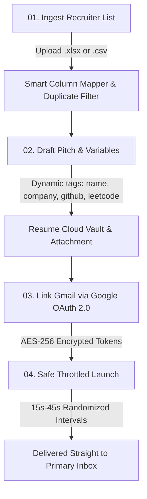

<div align="center">

# 🚀 CareerReach
### High-Deliverability Cold Outreach & Recruiter Personalization Platform

[](https://careerreach.vercel.app/)
[](https://openjdk.org/)
[](https://spring.io/projects/spring-boot)
[](https://react.dev/)
[](https://www.typescriptlang.org/)
[](https://tailwindcss.com/)
[](https://www.postgresql.org/)
[](https://www.docker.com/)

<p align="center">
  <b>Replace 4+ hours of manual cold emailing with a single 3-minute sequence.</b><br />
  Personalize recruiter outreach, auto-inject dynamic profile links, attach verified resume PDFs, and deliver directly to primary inboxes through your authentic Google account.
</p>

<p align="center">
  <a href="https://careerreach.vercel.app/" target="_blank">
    
  </a>
</p>

[🌐 Live App](https://careerreach.vercel.app/) •
[Key Features](#-key-features) •
[Why CareerReach](#-why-careerreach) •
[System Architecture](#-system-architecture) •
[How It Works](#-how-it-works) •
[Tech Stack](#-technology-stack) •
[Quickstart](#-quickstart-guide) •
[API Reference](#-api-documentation)

---

</div>

## 💡 Why CareerReach?

Applying for software engineering and tech roles through standard job boards often feels like throwing resumes into a black hole. Sending direct emails to hiring managers and tech recruiters gets **10x higher response rates**, but doing it manually is painful:

* ⏳ **Tedious Copy-Pasting:** Constantly switching tabs to copy your GitHub, LeetCode, portfolio, and resume links into every email.
* 📬 **The Spam Trap:** Third-party bulk senders and unverified SMTP servers trigger Google spam filters and land in the *Promotions* or *Spam* folders.
* ⚠️ **Embarrassing Mistakes:** Double-contacting the same recruiter at the same company with mismatched variables.

**CareerReach solves this entirely.** It connects directly to your verified personal Gmail via official Google OAuth 2.0, ingests your recruiter spreadsheets, automatically substitutes platform links without copy-pasting, and dispatches each draft with human-like randomized delays to ensure primary inbox delivery.

---

## ✨ Key Features

### ⚡ 1. Dynamic Variable Link Injection (Zero Copy-Pasting)
Save your profile links once in **Settings** (`GitHub`, `LeetCode`, `Portfolio`, `Codeforces`, etc.). In your email templates, use dynamic variables like `{{github}}`, `{{leetcode}}`, and `{{portfolio}}`. CareerReach automatically substitutes your live URLs into clean, clickable hyperlinks for each recipient.

### 📥 2. Instant Excel & CSV Contact Ingestion
* Drop in `.xlsx`, `.xls`, or `.csv` spreadsheets with recruiter names, titles, and emails.
* **Interactive Column Mapper:** Seamlessly map columns (`Full Name`, `Company`, `Email`, `Position`).
* **10-Row Visual Preview & Dry Run:** Automatically checks email syntax and filters duplicates before saving to the database.

### 🔒 3. Direct Google OAuth 2.0 (Primary Inbox Delivery)
* No app passwords or risky SMTP relay servers.
* Authorize directly through Google to dispatch emails from your personal mailbox.
* Your Google access tokens are **encrypted at rest with AES-256-GCM** and never exposed client-side.
* Instant 1-click token revocation and data deletion anytime.

### ⏱️ 4. Anti-Spam Randomized Throttle Engine
* Dispatches messages with randomized interval jitter (**15s–45s gaps**) to strictly mimic natural human sending behavior and respect Google rate limits.
* **Live Queue Controls:** Real-time Pause, Resume, and Stop controls with live status tracking per recipient.

### 📄 5. Cloud Resume Vault & PDF Attachment
* Store resumes securely in cloud storage (Supabase / S3).
* Validates PDF headers (`%PDF-`) and byte safety using **Apache PDFBox** before dispatching.
* Cleanly encodes and attaches your resume PDF directly to outgoing emails.

### 🛡️ 6. Pre-Flight Safety & Duplicate Shield
* Scans target lists against past campaigns and templates.
* 1-click duplicate suppression prevents messaging the same recruiter twice.
* Opt-out & unsubscribe tracking automatically honors recipient preferences.

---

## 🏗️ System Architecture

```
                             ┌──────────────────────────────────────────────────┐
                             │              Modern React 18 SPA                 │
                             │       (Vite + TypeScript + Tailwind CSS)         │
                             │     Floating Header • Subpages • Live Simulator  │
                             └────────────────────────┬─────────────────────────┘
                                                      │ REST API / JWT (Bearer)
                                                      ▼
                             ┌──────────────────────────────────────────────────┐
                             │          Spring Boot 3.4.2 Application           │
                             │  ┌────────────────────────────────────────────┐  │
                             │  │ Security & Auth (JWT + BCrypt + AES-256)   │  │
                             │  ├────────────────────────────────────────────┤  │
                             │  │ Contact Ingestion (Apache POI & CSV)       │  │
                             │  ├────────────────────────────────────────────┤  │
                             │  │ Variable Engine (Merge Tags & Links)       │  │
                             │  ├────────────────────────────────────────────┤  │
                             │  │ Resume Vault (Apache PDFBox Sanitizer)     │  │
                             │  ├────────────────────────────────────────────┤  │
                             │  │ Background Dispatcher (Throttling & Jitter)│  │
                             │  ├────────────────────────────────────────────┤  │
                             │  │ Orphan Recovery (Auto-heal stalled batches)│  │
                             │  └──────┬───────────────┬────────────────┬────┘  │
                             └─────────┼───────────────┼────────────────┼───────┘
                                       │               │                │
                         JDBC (Hikari) │   OAuth / API │  REST / S3 API │
                                       ▼               ▼                ▼
                         ┌───────────────────┐ ┌───────────────┐ ┌───────────────────┐
                         │   PostgreSQL 16   │ │ Google Gmail  │ │ Supabase Storage  │
                         │ - Users & Tokens  │ │ - gmail.send  │ │ - PDF Resumes     │
                         │ - Recruiter DB    │ │ - Encrypted   │ │ - Tenant Isolated │
                         │ - Campaign Logs   │ │   Tokens      │ │                   │
                         └───────────────────┘ └───────────────┘ └───────────────────┘
```

---

## 🔄 How It Works



1. **Import Contacts:** Drop in a list of hiring managers. Map names, emails, and company titles with automatic syntax and duplicate validation.
2. **Draft Pitch:** Compose your email once using merge tags (`{{name}}`, `{{company}}`) and dynamic link variables (`{{github}}`, `{{leetcode}}`). Attach your resume PDF seamlessly.
3. **Connect Gmail:** Secure 1-click Google OAuth 2.0 authentication. Your password is never seen, stored, or accessible.
4. **Launch Safely:** Watch emails dispatch with randomized human-like delays, live delivery feedback, and full pause/resume control.

---

## 🛠️ Technology Stack

| Domain | Technologies |
|---|---|
| **Backend Core** | Java 21, Spring Boot 3.4.2, Spring Security 6 |
| **Data & Persistence** | PostgreSQL 16, Spring Data JPA, Hibernate, HikariCP |
| **File Processing** | Apache POI 5.2.5 (Excel), Apache Commons CSV 1.10.0, Apache PDFBox 3.0.4 |
| **Integrations** | Google APIs Client Library 2.4.0, Gmail API v1, Supabase Cloud Storage |
| **Security & Crypto** | JJWT 0.12.6, BCrypt Password Hashing, AES-256-GCM Token Encryption |
| **Frontend Core** | React 18.3, Vite 5.4 / 8.3, TypeScript 5.5 |
| **Styling & Icons** | Tailwind CSS 3.4, Lucide React Icons, Glassmorphism UI |
| **Routing & State** | React Router v6, React Context API, Axios |
| **Deployment** | Docker, Multi-Stage Builds, Vercel SPA Rewrites |

---

## 🚀 Quickstart Guide

> 💡 **Try it without local setup:** The production web app is deployed live at **[https://careerreach.vercel.app/](https://careerreach.vercel.app/)**.

### Prerequisites
* **Java:** JDK 21+
* **Node.js:** 20.x+ & `npm`
* **PostgreSQL:** 16+ running locally on port `5432`
* **Google Cloud Console:** OAuth 2.0 Web Client credentials (Gmail API enabled)
* **Supabase Account:** Project URL and Service Role Key (for resume storage)

---

### Step 1: Clone & Database Setup

```bash
git clone https://github.com/utkarshjain45/CareerReach.git
cd CareerReach
```

Create the local PostgreSQL database:
```sql
CREATE DATABASE careerreach_db;
```

---

### Step 2: Backend Configuration

Create a `.env` file in the `backend/` directory:

```env
# Database
DB_HOST=localhost
DB_PORT=5432
DB_NAME=careerreach_db
DB_USERNAME=postgres
DB_PASSWORD=postgres

# Security Secrets
JWT_SECRET=404E635266556A586E3272357538782F413F4428472B4B6250645367566B5970
TOKEN_ENCRYPTION_SECRET=mySuperSecretEncryptionKey32Chars!

# Google OAuth 2.0 (Gmail API)
GOOGLE_CLIENT_ID=your-google-client-id.apps.googleusercontent.com
GOOGLE_CLIENT_SECRET=your-google-client-secret
GOOGLE_REDIRECT_URI=http://localhost:5173/settings

# Supabase Storage (Resumes)
SUPABASE_URL=https://your-project.supabase.co
SUPABASE_SERVICE_ROLE_KEY=your-supabase-service-role-key
SUPABASE_BUCKET_RESUMES=careerreach-resumes
```

Start the backend:
```bash
cd backend
./mvnw clean spring-boot:run
```
*Backend API boots at `http://localhost:8080`.*

---

### Step 3: Frontend Setup

Create a `.env` file in `frontend/`:
```env
VITE_API_URL=http://localhost:8080
```

Install packages and run the dev server:
```bash
cd frontend
npm install
npm run dev
```
*Frontend interface boots at `http://localhost:5173`.*

---

## 🐳 Running with Docker Compose

Deploy the entire stack with a single command:

```bash
# Export required secrets
export GOOGLE_CLIENT_ID="your_client_id"
export GOOGLE_CLIENT_SECRET="your_client_secret"
export GOOGLE_REDIRECT_URI="http://localhost/settings"
export TOKEN_ENCRYPTION_SECRET="mySuperSecretEncryptionKey32Chars!"
export SUPABASE_URL="https://your-project.supabase.co"
export SUPABASE_SERVICE_ROLE_KEY="your_service_role_key"
export SUPABASE_BUCKET_RESUMES="careerreach-resumes"

# Build and start services
docker-compose up --build -d
```

* **Frontend:** `http://localhost`
* **Backend API:** `http://localhost:8080/api`
* **PostgreSQL:** `localhost:5432`

---

## 📡 API Documentation

| Method | Endpoint | Description |
|:---:|---|---|
| `POST` | `/api/auth/register` | Register a new user account |
| `POST` | `/api/auth/login` | Authenticate and obtain JWT token |
| `GET` | `/api/auth/me` | Fetch authenticated user profile |
| `GET` | `/api/dashboard/stats` | Real-time campaign stats and KPI metrics |
| `POST` | `/api/contacts/import/preview` | Upload file for column detection & 10-row preview |
| `POST` | `/api/contacts/import` | Commit contacts with custom column mappings |
| `GET` | `/api/contacts` | Paginated recruiter contacts with search & status filters |
| `PATCH`| `/api/contacts/{id}/status` | Update contact status (`LEAD`, `CONTACTED`, `UNSUBSCRIBED`) |
| `GET` | `/api/templates` | Search and list outreach templates |
| `POST` | `/api/templates/{id}/duplicate` | Clone an existing template |
| `POST` | `/api/attachments` | Upload resume PDF to Supabase cloud storage |
| `GET` | `/api/attachments` | List uploaded user resumes |
| `DELETE`| `/api/attachments/{id}` | Delete resume attachment from cloud storage |
| `POST` | `/api/campaigns/check-duplicates` | Pre-send recipient duplication analysis |
| `POST` | `/api/campaigns/validate-preflight`| Pre-flight check on Gmail, templates & recipients |
| `POST` | `/api/campaigns` | Initialize a new outreach campaign |
| `POST` | `/api/campaigns/{id}/start` | Launch asynchronous throttled background dispatch |
| `POST` | `/api/campaigns/{id}/pause` | Pause active dispatch sequence |
| `POST` | `/api/campaigns/{id}/resume` | Resume paused sequence |
| `POST` | `/api/campaigns/{id}/cancel` | Abort campaign |
| `GET` | `/api/oauth/gmail/url` | Generate Google OAuth authorization URL |
| `POST` | `/api/oauth/gmail/callback` | Exchange OAuth code for encrypted tokens |
| `DELETE`| `/api/oauth/gmail/disconnect` | Revoke tokens and disconnect Google account |
| `GET` | `/api/settings` | Get sending preferences & saved profile links |
| `PUT` | `/api/settings` | Update rate limits and candidate social variables |

---

## 🔒 Security Principles

1. **Zero Raw Password Storage:** All user credentials hashed with BCrypt. Gmail access tokens use restricted Google OAuth 2.0 scopes (`gmail.send`, `userinfo.email`).
2. **Encrypted at Rest:** Refresh and access tokens are encrypted with **AES-256-GCM** using unique initialization vectors.
3. **Stateless JWT Authorization:** Secured with HMAC-SHA256, auto-expiring, and validated client- and server-side.
4. **Tenant Isolation:** Every query, contact, campaign, and file attachment is strictly isolated by authenticated `user_id`.
5. **Fail-Safe Orphan Recovery:** Server crashes or restarts automatically heal orphaned campaigns into a `PAUSED` state without duplicate sends.

---

## 📄 License

This project is licensed under the [MIT License](LICENSE).
